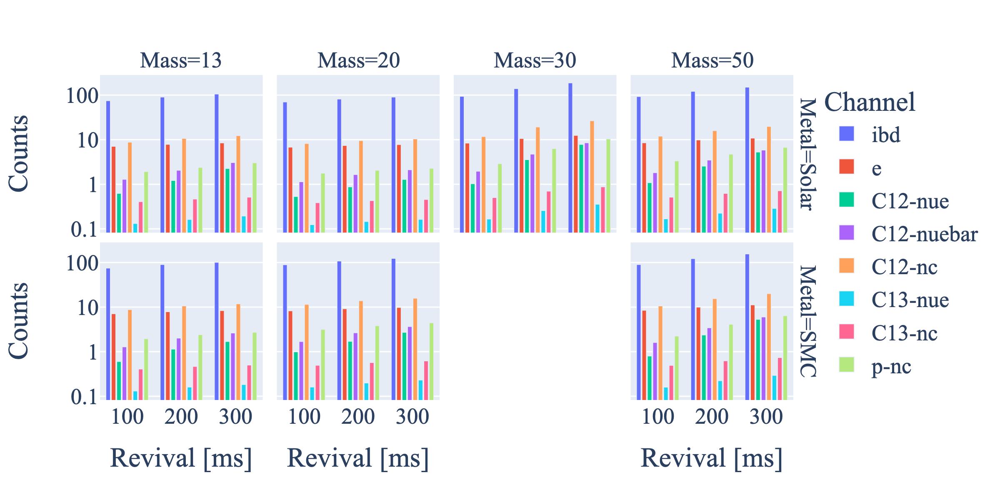

SN model descriptions
=====================

Supernovae simulation model descriptions.

.. warning::

   A lot of the content is my notes and may contain inaccuracies as things are in development.

Nakazato 2013
-------------

Splice of burst and cooling.

Events by channel for Nazato simulations.

Fornax
------

2D simulations.

Warren
------

Lots of simulations.
